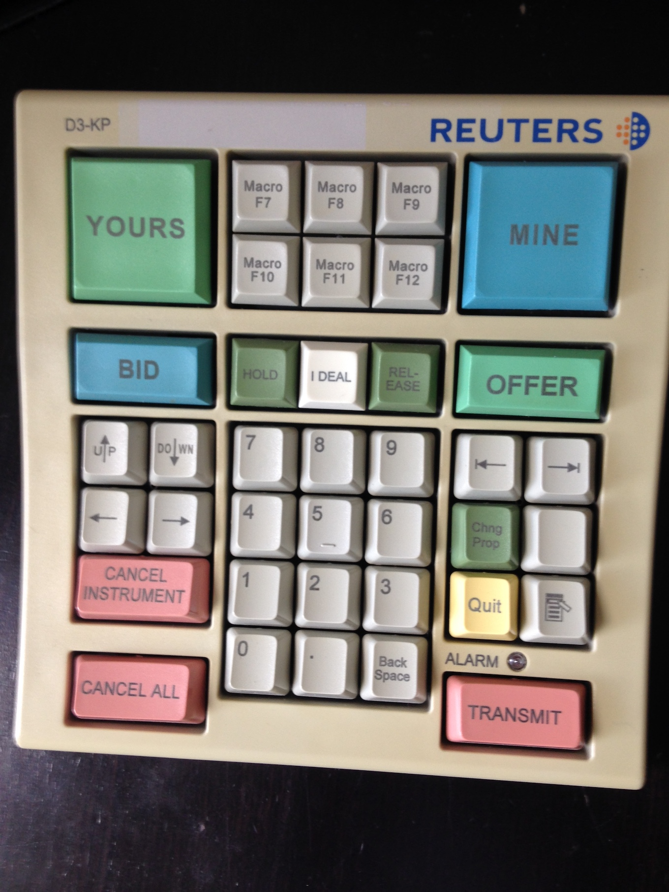

Hand wired Reuters D3-KP using two teensy 3.2 Development Boards
================================

Source code for the matrix keyboard layout is available here: <http://github.com/tmk/tmk_keyboard>

Features
--------
These features can be used in your keyboard.

* Multi-layer Keymap  - Multiple keyboard layouts with layer switching

[GH60]:         http://geekhack.org/index.php?topic=34959
[GH60_proto]:   http://geekhack.org/index.php?topic=37570.0

License
-------
**GPLv2** or later. Some protocol files are under **Modified BSD License**.

Third party libraries like LUFA, PJRC and V-USB have their own license respectively.

Files and Directories
-------------------
### Top
* Keypad_Top    - Keypad Top Layout
* Keypad_Bottom - Keypad Bottom Layout 
* tmk_core/     - core library
* Pictures      - Pictures of soldering and wiring process

Coding Style
-------------
Use 4 spaces, no tabs
